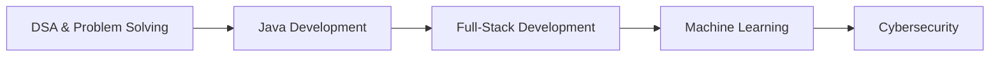

 

---

## About

I'm a Computer Science Engineering student who learns by shipping. My work spans full-stack web apps, machine learning with explainability, and security.

| | |
|---|---|
| **Studying** | B.Tech, Computer Science Engineering |
| **Building** | Full-stack apps and ML-based security tools |
| **Strengthening** | Java, DSA, React, Node.js, Machine Learning |
| **Looking for** | Software development opportunities |

## Tech Stack

**Languages** 
  
**Web & Databases** 
  
**Tools** 
  
**Machine Learning** 
`Python` `Scikit-learn` `XGBoost` `Pandas` `NumPy` `TF-IDF` `SHAP` `Matplotlib` `Streamlit` `Flask`

## Featured Projects

<table>
<tr>
<td width="50%" valign="top">

### WanderLust
An Airbnb-inspired full-stack app with listing management, image handling and map features.

`Node.js` `Express` `MongoDB` `EJS` `Cloudinary` `Mapbox`

[Repository](https://github.com/6387anu/WanderLust) · [Live demo](https://wanderlust-fmt4.onrender.com/listings)

</td>
<td width="50%" valign="top">

### SQL Injection Detection
Detects SQL injection with character-level TF-IDF and XGBoost. SHAP explains each prediction.

`Python` `XGBoost` `SHAP` `Scikit-learn` `Streamlit`

[Repository](https://github.com/6387anu/SQL-Injection-Detection-Using-Machine-Learning) · [Live demo](https://sql-detection.streamlit.app/)

</td>
</tr>
<tr>
<td width="50%" valign="top">

### Tourist Itinerary Planner
An interactive, map-based web project for planning tourist itineraries.

`JavaScript` `Leaflet` `Mapbox` `HTML` `CSS`

</td>
<td width="50%" valign="top">

### SoftCompiler
An AI-oriented project with a FastAPI backend and Gemini API integration for automated processing.

`Python` `FastAPI` `Gemini API`

</td>
</tr>
</table>

## Learning Path

## GitHub Stats

---

**Build · Learn · Improve**

