 

---

## About

## Tech Stack

## Featured Projects

<table>
<tr>
<td width="50%" align="center">
 
<a href="https://github.com/6387anu/WanderLust">Repository</a> · <a href="https://wanderlust-fmt4.onrender.com/listings">Live demo</a>
</td>
<td width="50%" align="center">
 
<a href="https://github.com/6387anu/SQL-Injection-Detection-Using-Machine-Learning">Repository</a> · <a href="https://sql-detection.streamlit.app/">Live demo</a>
</td>
</tr>
</table>

## GitHub Stats

---

**Build · Learn · Improve**

